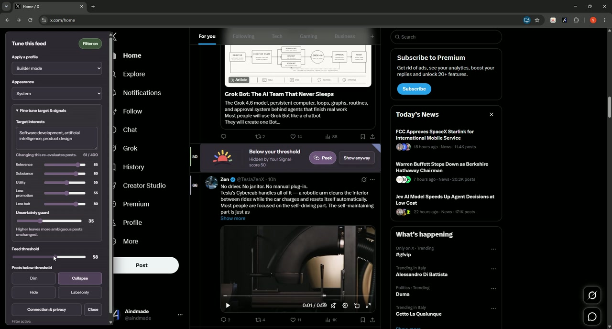
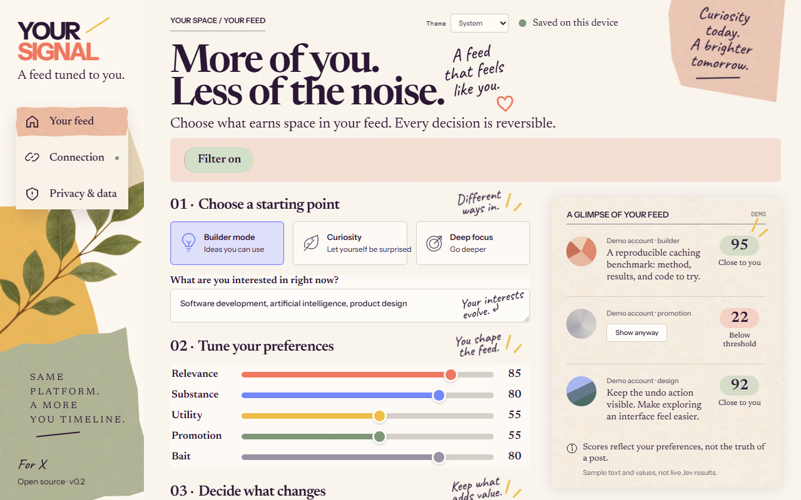
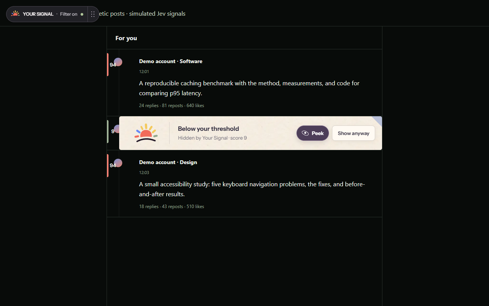

# Your Signal

**A feed tuned to you.** Your Signal is an open-source Chrome extension that applies personal, reversible filters to the X timeline. You choose the interests, weights, threshold, and visual treatment. Jev evaluates the text; the extension makes every display decision on your device.

[Download releases](https://github.com/MithrilMan/your-signal/releases) · [Source code](https://github.com/MithrilMan/your-signal) · [Privacy policy](PRIVACY.md) · [Security](SECURITY.md) · MIT licensed

## See it in action

[](https://mithrilman.github.io/your-signal/artifacts/your-signal-demo-social.mp4)

**[Watch the 76-second product demo →](https://mithrilman.github.io/your-signal/artifacts/your-signal-demo-social.mp4)** See a real X timeline move from feed noise to a personal, reversible signal—without artificial camera movement or staged slides.





## What it does

- Scores visible X posts for relevance, substance, practical value, promotion, and engagement bait.
- Highlights, labels, dims, collapses, or hides posts according to your settings.
- Keeps every change reversible, including a playful Peek interaction for collapsed posts.
- Offers built-in and saved profiles directly in the X overlay and extension popup.
- Supports System, Light, and Dark appearance.
- Stores preferences locally and includes no telemetry.

## Direct BYOK flow

Your Signal has one connection path:

```text
X page → extension service worker → TypeSafe Jev API
                              ↓
                    numeric signals only
                              ↓
                 local scoring and display
```

You supply your own Jev API key. When filtering is enabled, the extension sends eligible post text and your interest topics directly to `https://api.typesafe.ai`. Your Signal does not operate an intermediary service, user registration, analytics, or payment flow.

This is extension-only software, not offline AI. TypeSafe processes the text remotely under its own terms and privacy policy. Your API key is session-only by default; remembering it is an explicit opt-in and browser local storage is not an encrypted keychain.

## Install a packaged release

1. Download `your-signal-extension.zip` and `SHA256SUMS.txt` from the [latest release](https://github.com/MithrilMan/your-signal/releases/latest).
2. Verify the checksum and extract the ZIP.
3. Open `chrome://extensions`, enable **Developer mode**, choose **Load unpacked**, and select the extracted directory.

## Install from source

1. Clone this repository.
2. Open `chrome://extensions` in Chrome.
3. Enable **Developer mode**.
4. Choose **Load unpacked** and select the `extension/` directory.
5. Open the extension settings, paste a Jev API key, review the data-flow disclosure, and save the connection.
6. Enable the filter and open `https://x.com/home`.

The extension asks for TypeSafe host access only when you connect. Removing the key also revokes that optional permission.

## Development

The extension uses dependency-free Manifest V3 JavaScript, HTML, and CSS. Node.js 22+ runs the unit tests; Python is used for the build, evaluation tools, and browser smoke tests.

```bash
npm test
python -m pytest -q eval/tests
python eval/run.py eval/examples.jsonl
python tests/browser_smoke.py
python tests/extension_smoke.py
python tests/x_injection_smoke.py
npm run build
```

`npm run build` creates `release/extension/` and `release/your-signal-extension.zip`. Branch CI uploads the ZIP as a workflow artifact; pushing a matching `v*` tag creates the GitHub release and checksum automatically.

## Repository layout

```text
extension/         Manifest V3 extension
shared/rubric.json Versioned Jev evaluation contract
tests/             Unit, UI, native MV3, and X fixture tests
eval/              Synthetic evaluation corpus and metrics
scripts/build.py   Deterministic extension package builder
docs/              Architecture and publication material
artifacts/         Launch-ready demo media and editing recipe
```

## Privacy and platform scope

Your Signal reads text already rendered in supported X timelines. It does not read private messages, cookies, passwords, or image contents. Posts visible from protected profiles may still contain sensitive text, so enable the filter only if you accept sending eligible post text to TypeSafe.

Before distributing the extension, confirm that its use and DOM interaction comply with the current X terms and Chrome Web Store policies. Your Signal is not affiliated with, endorsed by, or sponsored by X Corp. or TypeSafe.

## License

Copyright © 2026 Your Signal contributors. Source code is released under the [MIT License](LICENSE). Bundled fonts use the SIL Open Font License; see [third-party notices](THIRD_PARTY_NOTICES.md).
